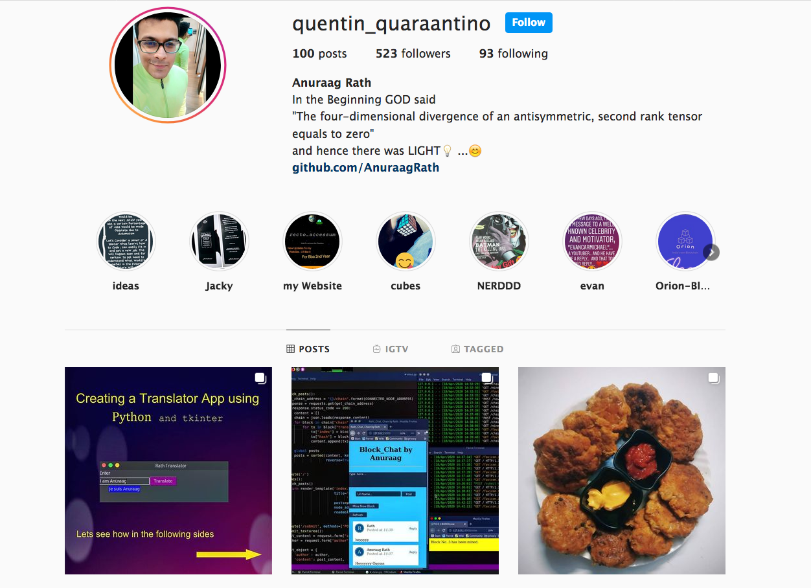

### print('Hello World ')

I'm Anuraag Rath. I love working with Tech and building cool stuff.

🔭 I’m currently working on 

 

Top Languages used by me:

  [Send your valuable feedback about my Repositories 💬](https://support.github.com/contact/feedback?category=profile&subject=Profile+README)

I keep uploading new stuff here and on my Instagram page

Follow me on Instagram 📫 💬  - [@psycho_analystt](https://www.instagram.com/psycho_analystt)

## Check out my Resume

## MBA Thesis:
AN IMPLEMENTATION OF MACHINE LEARNING 
ON CUSTOMERS' PURCHASE DATASET 
OF HOTEL GRAND CENTRAL

## My Website:

# Enjoyyy

Start by checking out my Pinned Repositories 😄 

<!--
**AnuraagRath/AnuraagRath** is a ✨ _special_ ✨ repository because its `README.md` (this file) appears on your GitHub profile.
"
Here are some ideas to get you started:

- 🔭 I’m currently working on ...
- 🌱 I’m currently learning ...
- 👯 I’m looking to collaborate on ...
- 🤔 I’m looking for help with ...
- 💬 Ask me about ...
- 📫 How to reach me: ...
- 😄 Pronouns: ...
- ⚡ Fun fact: ...
-->
